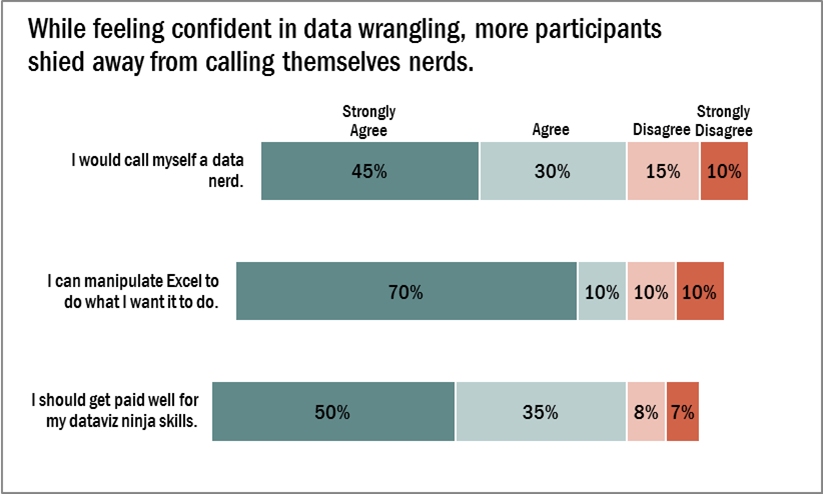

# Benchmark Metadata

| id  | file       | reference chart | source | scenario |
|-----|------------|-----------------|--------|------|
| 001 | [001.json](001.json) |  | [source_link](https://www.tutorialspoint.com/excel_data_analysis/excel_data_analysis_visualization.htm) | excel |
| 002 | [002.json](002.json) |  | [source_link](https://www.tutorialspoint.com/excel_data_analysis/excel_data_analysis_visualization.htm) | excel |
| 003 | [003.json](003.json) |  | [source_link](https://www.tutorialspoint.com/excel_data_analysis/excel_data_analysis_visualization.htm) | excel |
| 004 | [004.json](004.json) |  | [source_link](https://excelcharts.com/excel-users-guide-make-charts-tableau) | excel |
| 005 | [005.json](005.json) |  | [source_link](https://www.optimizesmart.com/how-to-select-best-excel-charts-for-your-data-analysis-reporting/) | excel |
| 006 | [006.json](006.json) |  | [source_link](http://stephanieevergreen.com/overlapping-bars/) | excel |
| 007 | [006.json](007.json) |  | [source_link](http://stephanieevergreen.com/diverging-stacked-bars/) | excel |
| 008 | [006.json](008.json) |  | [source_link](http://stephanieevergreen.com/adding-standard-deviation-to-a-dataviz/) | excel |
| 009 | [006.json](009.json) |  | [source_link](http://stephanieevergreen.com/dumbbell-dot-plot/) | excel |
| 010 | [006.json](010.json) |  | [source_link](http://stephanieevergreen.com/easy-dot-plots-in-excel/) | excel |
| 011 | [006.json](011.json) |  | [source_link](http://www.storytellingwithdata.com/blog/2017/12/14/how-we-position-and-what-we-compare?rq=Excel) | excel |
| 012 | [006.json](012.json) |  | [source_link](http://www.storytellingwithdata.com/blog/2017/12/14/how-we-position-and-what-we-compare?rq=Excel) | excel |
| 013 | [006.json](013.json) |  | [source_link](https://peltiertech.com/add-totals-to-stacked-column-chart/) | excel |
| 014 | [006.json](014.json) |  | [source_link](https://peltiertech.com/repeated-gantt-chart-track-ice-time/) | excel |
| 015 | [006.json](015.json) |  | [source_link](https://peltiertech.com/repeated-gantt-chart-track-ice-time/) | excel |
| 016 | [006.json](016.json) |  | [source_link](https://peltiertech.com/revenue-chart-showing-year-over-year-variances/) | excel |
| 017 | [006.json](017.json) |  | [source_link](https://peltiertech.com/chart-actual-solid-lines-projected-dashed-lines/) | excel |
| 018 | [006.json](018.json) |  | [source_link](https://www.guru99.com/visualizing-data-using-charts-in-excel.html) | excel |
| 019 | [006.json](019.json) |  | [source_link](https://chandoo.org/wp/histograms-pareto-charts-in-excel/) | excel |
| 020 | [006.json](020.json) |  | [source_link](https://www.excel-easy.com/examples/pivot-chart.html) | excel |
| 021 | [006.json](021.json) |  | [source_link](https://www.excel-easy.com/examples/pivot-chart.html) | excel |
| 022 | [006.json](022.json) |  | [source_link](https://medium.com/berkeleyischool/how-to-create-a-visualization-showing-events-on-time-series-data-in-excel-96abbc1475e0) | excel |
| 023 | [006.json](023.json) |  | [source_link](https://www.officetimeline.com/make-timeline/excel) | excel |
| 024 | [006.json](024.json) |  | [source_link](https://www.excel-easy.com/examples/gantt-chart.html) | excel |
| 025 | [006.json](025.json) |  | [source_link](https://www.excel-easy.com/examples/pareto-chart.html) | excel |
| 027 | [006.json](027.json) |  | [source_link](https://www.excel-easy.com/examples/moving-average.html) | excel |
| 028 | [006.json](028.json) |  | [source_link](https://www.excel-easy.com/examples/histogram.html) | excel |

<!-- 007 http://stephanieevergreen.com/diverging-stacked-bars/
008 http://stephanieevergreen.com/adding-standard-deviation-to-a-dataviz/
009 http://stephanieevergreen.com/dumbbell-dot-plot/
010 http://stephanieevergreen.com/easy-dot-plots-in-excel/
011 http://www.storytellingwithdata.com/blog/2017/12/14/how-we-position-and-what-we-compare?rq=Excel
012 http://www.storytellingwithdata.com/blog/2017/12/14/how-we-position-and-what-we-compare?rq=Excel
013 https://peltiertech.com/add-totals-to-stacked-column-chart/
014 https://peltiertech.com/repeated-gantt-chart-track-ice-time/
015 https://peltiertech.com/repeated-gantt-chart-track-ice-time/
016 https://peltiertech.com/revenue-chart-showing-year-over-year-variances/
017 https://peltiertech.com/chart-actual-solid-lines-projected-dashed-lines/
018 https://www.guru99.com/visualizing-data-using-charts-in-excel.html
019 https://chandoo.org/wp/histograms-pareto-charts-in-excel/
020 https://www.excel-easy.com/examples/pivot-chart.html
021 https://www.excel-easy.com/examples/pivot-chart.html
022 https://medium.com/berkeleyischool/how-to-create-a-visualization-showing-events-on-time-series-data-in-excel-96abbc1475e0
023 https://www.officetimeline.com/make-timeline/excel
024 https://www.excel-easy.com/examples/gantt-chart.html
025 https://www.excel-easy.com/examples/pareto-chart.html
027 https://www.excel-easy.com/examples/moving-average.html
028 https://www.excel-easy.com/examples/histogram.html -->